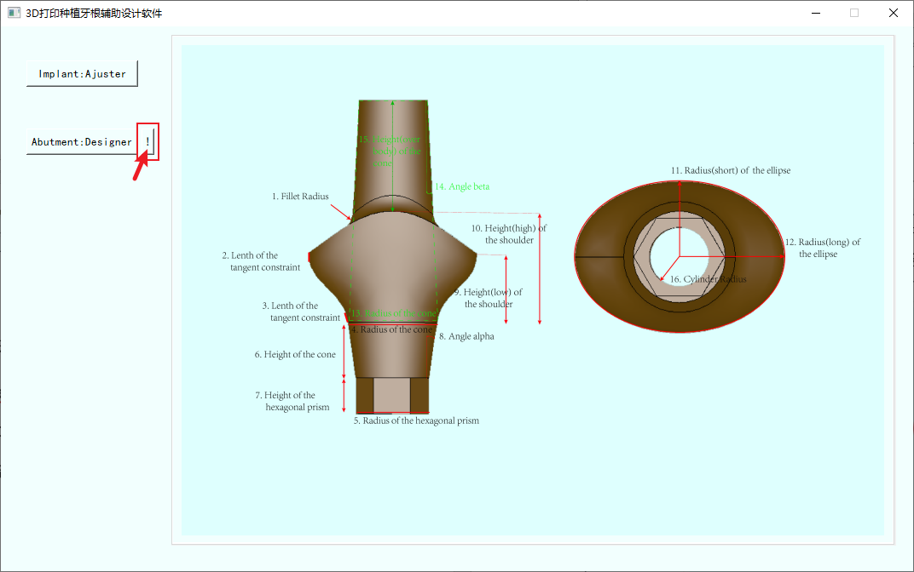

# RAI-Design-Software
These are original codes of a software for root analogue implant designing.
**3D printing software for dental implant aided design**

**instructions**

## introduction

### 1.1 purpose of writing

The dental model generated based on cone-beam CT scanning data (the same size as the primary tooth) is directly placed into the alveolar fossa after 3D printing. For the requirements of interference fit and preventing the bone plate from squeezing, several key feature sizes of the dental model need to be adjusted. Due to the inefficiency and unsatisfactory effect of model feature size adjustment caused by the non-targeted function of the existing software on the market, the development of "root model size adjustment" module is the main function of this software.

A complete dental implant system mainly includes two parts: root and abutment, that is, each root has its abutment. Therefore, the software is accompanied by a "parametric modeling of abutment" module. In this module, a three-dimensional model of the abutment can be generated according to the geometric parameters of the abutment input by the user, which can be used for multi-axis NC machine tool processing.

### 1.2 Software users

The software is easy to operate, and users can use it after short training, but the key input parameters need to be provided by professional dentists.

## 2 operating environment

### 2.1 hardware

a. Ordinary computer host (memory is greater than or equal to 4G, and main memory capacity is greater than or equal to 500G)

b. Ordinary display

c. Mouse and keyboard

### 2.2 Software

a. Operating system: Windows 10

b. Programming language: Python

c. Programming software: Pycharm (Community)

d. Compilation environment: Anaconda

e. Database: MySQL

## 3 instructions for use

### 3.1 Brief Description of Software

The design process of 3D printing dental implants is complicated, and this software only undertakes part of the process, as shown in the following figure (the function of this software is in the light blue area).

pictureoneBrief description of software

### 3.2 Login interface

picture2Login interface

The login interface mainly includes three elements.

One is the picture part, which is a carousel of four pictures to show users the main ideas and functions of the software. Fig. 3 is the data (gray picture) obtained by CBCT (cone beam CT) scanning, including the cross-sectional shape of teeth. Fig. 4 is a single tooth model of the whole mouth generated by image segmentation and reconstruction algorithm according to the data of fig. 3. Fig. 5 is a target tooth model selected by the user. Fig. 6 is a dental implant system formed by the cooperation of implant and abutment model constructed according to the dental model of the previous figure. At present, this software mainly realizes the functions of Figure 5 to Figure 6, and the functions between the previous figures will be realized in the subsequent updated version of the software.

|  picture3 L |  picture4 |  picture5 |  picture6 |
| ---------------------------------------------------------- | -------------------------------------------------------- | -------------------------------------------------------- | -------------------------------------------------------- |

The second element of the login interface is the login part, including the entry of account password, login and exit buttons.

Enter the user account name after the "Username" entry and the corresponding Password after the "password" entry. Click the "Log in" button, and the software will retrieve the database in MySQL. If there is no such account or the corresponding password is incorrect, an error prompt box will pop up, as shown below.

picturesevenInput error prompt box

Click the "Log in" button, and if the account password is correct, the login success message box will pop up. Click "OK" to enter the main interface of the program immediately, otherwise it will enter the main interface after waiting for 3 seconds.

pictureeightEnter the correct prompt box

Clicking the "Log out" button will exit the software.

The third element of the login interface is the registration part. Click the "Register" button to enter the registration interface.

### 3.3 Registration interface

The registration interface is shown in Figure 9 below.

picturenineAccount registration interface

Enter the account name for the "Username" entry, the Password for the "password" entry (6 digits or more), the password for the "Confirm" entry, and the key for the "Crack" entry. Click the "OK" button in the registration interface to perform the registration function; Click the "Cancel" button to return to the login main interface.

If the input account already exists, click the "OK" button and the following prompt box will pop up. Click the "OK" button in the prompt box to re-enter the account password.

picture10Prompt box already exists for the account.

If the password length is less than 6 digits, the following prompt box will pop up.

picture11Password length prompt box

If the key is entered incorrectly, the following prompt box will pop up.

picture12Key error prompt box

If all the entries are entered correctly, the following prompt box will pop up. Click "OK" in the message prompt box to return to the login main interface.

picture13Registration success prompt box

### 3.4 Software main interface

The main interface of the software is shown below.

picture14Software main interface

The two items on the left are module guide buttons. The button "Implant:Ajuster" is the model size adjustment module of guiding root, and the button "Abutment:Designer" is the parametric design module of guiding abutment. The right view box contains multiple controls, which are subordinate to the corresponding functional modules.

### 3.5 Root Model Size Adjustment Module

**Click the "Implant:Ajuster" button to jump to the root model size adjustment module. The main operation flow of this module is: after the model is put in place (posture adjustment), the model size is adjusted by the size adjustment algorithm.**

picture15Select the tooth model size adjustment module.

In the model display window, the blue, yellow and green lines represent the X, Y and Z axes respectively.

Click the "Read" button, select the dental model file (pcd format), and click Open.

picture16Select a dental model file

In the software model display window, you can see that the model is imported.

picture17Import model

Clicking the "Putoo" button can realize the function of putting the tooth model straight (that is, aligning the long axis, labial and buccal sides, proximal and distal sides of the tooth with the coordinate axis, and the center of mass of the model is at the origin).

picture18Place the dental model correctly.

Click the "Clear" button to clear the tooth model in the interface.

Although the algorithm used in "Putoo" can put the dental model correctly, the dental model has various shapes due to the complicated oral conditions. In order to enable professional designers to optimize and adjust the posture of the dental model according to their experience, the function of translating or rotating the model along the coordinate axis is specially designed, as shown in the following figure.

picture19Pose correction optimization module

Below the "Move" button, enter the translation distance (unit: mm) along the X, Y and Z axes from top to bottom, and click "Move" to complete the model movement, and the effect is shown in the following figure (for ease of understanding, the movement size is slightly larger for observation, and the actual operation adjustment range is generally small).

picture20Translation transformation

The "Rotate" button has the function of rotating around the coordinate axis (unit: angle), and the effect is as follows (for example, around the X axis).

picture21Rotational transformation

In the end, the model will only use the part below the XOY coordinate plane (used for the actual 3D printing and machining of the root), and the XOY plane is the upper surface of the root, so it is necessary to accurately determine the position of this surface. Therefore, the function of adjusting the height of the implant relative to the XOY plane is specially set, as shown below.

picture22Determine that position of the upper surface of the implant

The "Y+" button immediately turns the view to the positive direction of the Y axis, which is convenient for designers to observe, as shown below.

picture23Click the "Y+" button to adjust the view angle.

Where "1+",.1+"and .01+"respectively mean to translate the model by 1 mm, 0.1 mm and 0.01 mm along the positive direction of Z axis. A negative sign indicates translation in the negative direction of the Z axis. The effect is shown below.

picture24Coarse adjustment and fine adjustment buttons

After the model is put in place, the key fit dimensions can be adjusted. The key dimensions of the model mainly include lip and cheek thickness (to be reduced in the positive direction of X axis) and proximal and distal thickness (to be expanded in the direction of Y axis).

picture25Schematic diagram of tooth position (not displayed in this software)

picture26Adjustment of key fit size of model

Under "Expansion Value", enter the enlargement value (generally about 0.5 mm, depending on the patient's specific situation, given by the dentist after evaluation), and under "Shrinkage Value", enter the reduction value (generally about 1 mm, depending on the patient's specific situation, given by the dentist after evaluation). Click the "Refresh" button to adjust the size. The effect is as follows.

picture27Labiobuccal contraction

picture28Proximal-distal expansion

Click the "BiggestCircle" button, and you can calculate the maximum inscribed circle radius of the intersection surface between the XOY surface and the dental model, so as to provide the design dimension basis for the abutment that is matched with the implant in the future.

picture29Calculate the maximum inscribed circle of the intersection surface of implant and XOY plane

"back_color", "net_color" and "pts_color" are the color adjustment buttons for the view window background, XOY plane grid and model point respectively. Different users can change the color of the elements according to their own needs to facilitate observation.

Take "back_color" as an example to explain. After clicking, the color setting box pops up, and you can set the color.

picture30Color setting

Click "Savepcd" to save the model in PCD or ply format.

picture31Model preservation

### 3.6 Parametric modeling module of abutment

Click the button "Abutment:Designer" to jump to the parametric modeling module of the abutment. The main operation flow of this module is: the designer designs and calculates the parameters of the abutment in advance, then inputs the parameters into the corresponding input box and clicks the generate button to generate the 3D model of the abutment with one click.

picture32Parametric modeling module of abutment

Click "!" Button, the geometric meaning of each parameter will be displayed.

picture33Parameter schematic diagram

table34Geometric meaning of each abutment parameter

| **Parameter serial number** | **meaning**                                                  |
| --------------------------- | ------------------------------------------------------------ |
| 1.                          | Radius of transition fillet between cone and shoulder table above abutment |
| 2.                          | Vertical constraint length of side lofting surface terminal  |
| 3.                          | The starting end of the side lofting surface constrains the length tangentially along the connecting surface. |
| 4.                          | Radius of circle on the cone of abutment and implant.        |
| 5.                          | Radius of circumscribed circle of hexagonal prism            |
| 6.                          | Height of cone side of abutment and implant                  |
| 7.                          | Hexagonal prism height                                       |
| 8.                          | Cone side taper of abutment and implant                      |
| 9.                          | Height of lowest point of shoulder table                     |
| 10.                         | Height of the highest point of shoulder table                |
| 11.                         | Shoulder overlooking elliptical short diameter               |
| 12.                         | The long diameter of ellipse overlooking the shoulder        |
| 13.                         | Radius of the lower circle of the cone above the abutment (for design purposes only, not the actual structural size, so the dotted line is used) |
| 14.                         | Cone taper above abutment                                    |
| 15.                         | The cone above the abutment is higher than the height of the shoulder part. |
| 16.                         | Radius of cylindrical through hole in abutment               |

The "Recomn" button can be used to calculate "r_Hex" and "rd \_ rT_DCon" (suffix "RecVal" in the figure) after inputting numerical values in these items in advance.

picture35"Recomn" button function

Enter all the pre-designed parameters in the input box, and click the "Create" button to generate a three-dimensional platform model, as shown below.

picture36Parametric modeling

Click the "Clear" button to clear all the values in the input box with one click, so as to facilitate re-input.

Click "Save" button to save the model in stp format.

picture37Save abutment model

# It is free for study. If for business，please contact with Zhejiang University.
